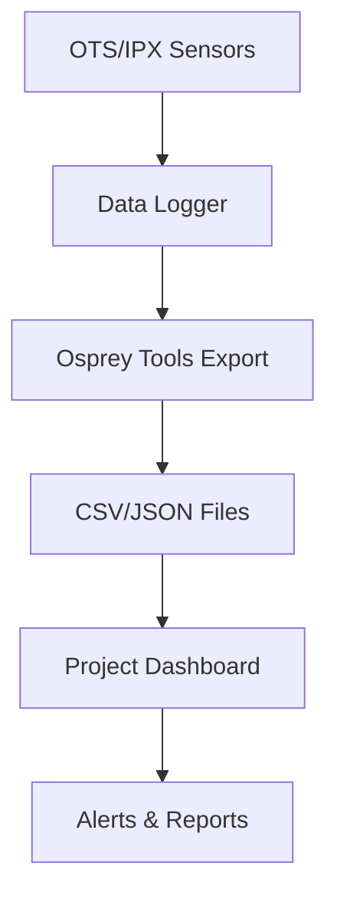

## Overview

Follow these guidelines to operate Osprey Tilt String (`OTS`) and In-Place Extensometer (`IPX`) devices effectively. You perform daily checks, interpret tilt and settlement data, adjust sensor configurations, and integrate readings into your project management tools. These practices ensure accurate geotechnical monitoring for civil and resources projects.

<Callout kind="tip">
Prepare your monitoring station with stable power and network access before starting daily procedures.
</Callout>

## Daily Monitoring Procedures

Establish a routine to maintain data integrity. Complete these steps each day to verify device health and capture reliable measurements.

<Steps>
  <Step title="Power On Devices" icon="zap">
    Connect the `OTS` or `IPX` to your data logger. Wait for the status LED to turn green, indicating readiness.

    Verify cable connections at the serial bus for `OTS` (up to 150 sensors).
  </Step>
  <Step title="Run Diagnostics" icon="settings">
    Use the Osprey Tools software to execute a self-test.

````bash
ots-diagnostics --device /dev/ttyUSB0 --output report.csv
````

  </Step>
  <Step title="Record Readings" icon="database">
    Log tilt angles and extensometer displacements. Export data as CSV for review.

    Check for anomalies like sudden jumps `{>0.5°}` in tilt values.
  </Step>
  <Step title="Backup Data" icon="upload">
    Upload logs to your secure storage. Schedule automated backups via cron jobs.
  </Step>
</Steps>

## Data Interpretation

Interpret measurements to detect settlement, tilt, or structural shifts. Use thresholds tailored to your project.

<Tabs>
  <Tab title="Tilt Analysis (OTS)" icon="trending-up">
    Focus on angular changes along the string. Normal drift is `{<0.1°/day}`; investigate `{>0.5°}`.

    | Position | Tilt (°) | Status     |
    |----------|----------|------------|
    | 1-10     | 0.02     | Stable    |
    | 11-20    | 0.6      | Alert     |
    | 21-30    | 0.01     | Stable    |

    Plot data to visualize deformation profiles.
  </Tab>
  <Tab title="Settlement (IPX)" icon="activity">
    Track linear extension. Values `{>2mm}` indicate potential settlement.

````python
import pandas as pd
df = pd.read_csv('ipx-data.csv')
settlement = df['displacement_mm'].max()
if settlement > 2:
    print("Alert: Significant settlement detected")
````

  </Tab>
</Tabs>

## Sensor Spacing and Precision Adjustments

Customize `OTS` sensor density for your needs. Closer spacing increases precision but raises costs.

<Columns cols={3}>
  <Card title="High Precision" icon="target">
    0.5m spacing for critical zones like tower cores.
  </Card>
  <Card title="Standard" icon="check-circle">
    2m spacing for general retaining walls.
  </Card>
  <Card title="Distributed" icon="map-pin">
    5m spacing for event detection on pipelines.
  </Card>
</Columns>

<Expandable title="Adjustment Steps" default-open="true">
  1. Power down the system.
  2. Reconfigure bus in Osprey Tools: `ots-config --spacing 2.0`.
  3. Test with 10-sample calibration.
</Expandable>

## Integration with Project Workflows

Incorporate Osprey data into tools like GIS software or dashboards. Automate processing for real-time alerts.

<CodeGroup tabs="Python,JavaScript">
````python
import requests
import pandas as pd

response = requests.get('https://api.example.com/ots/data?device_id=YOUR_DEVICE_ID')
df = pd.DataFrame(response.json()['readings'])
df.to_csv('project-data.csv')
````
````javascript
const fetch = require('node-fetch');
const fs = require('fs');

fetch('https://api.example.com/ots/data?device_id=YOUR_DEVICE_ID')
  .then(res => res.json())
  .then(data => fs.writeFileSync('project-data.json', JSON.stringify(data)));
````
</CodeGroup>



<Callout kind="success">
Review data weekly and calibrate quarterly to maintain accuracy `{<0.05°}`.
</Callout>

Link to [Quickstart](/quickstart) for initial setup and [Introduction](/introduction) for device specs.